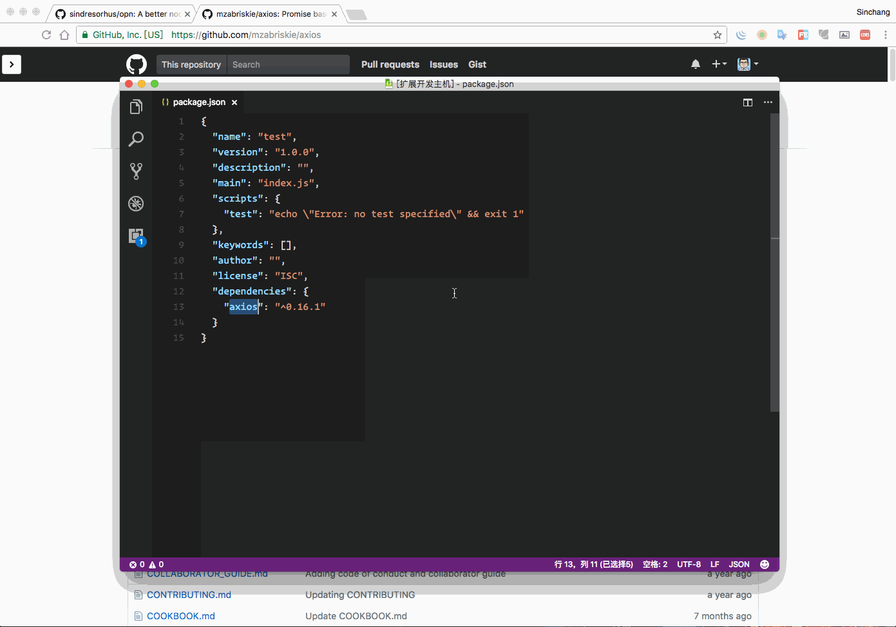

# packagelinker

> quickly find the GitHub URL of the package in VS Code. support Node、Ruby、Python、PHP.

## Screenshot

## Changelog

- v0.0.4: new support search Ruby、Python、PHP package.
- v0.0.5: fix a [bug](https://github.com/sinchang/packagelinker/issues/3) by [kurtextrem](https://github.com/kurtextrem)
- v0.0.6: update api url and support use extension on specific file suffix.

## Thanks

- [OctoLinker API](https://github.com/OctoLinker/live-resolver)

## Author

**packagelinker** © [sinchang](https://github.com/sinchang), Released under the [MIT](./LICENSE) License. 
Authored and maintained by sinchang with help from contributors ([list](https://github.com/sinchang/packagelinker/contributors)).

> [sinchang.me](https://sinchang.me) · GitHub [@sinchang](https://github.com/sinchang) · Twitter [@sinchangwen](https://twitter.com/sinchangwen)

